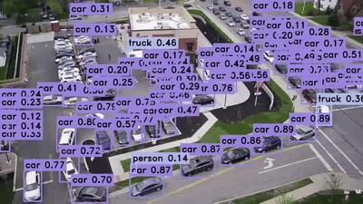
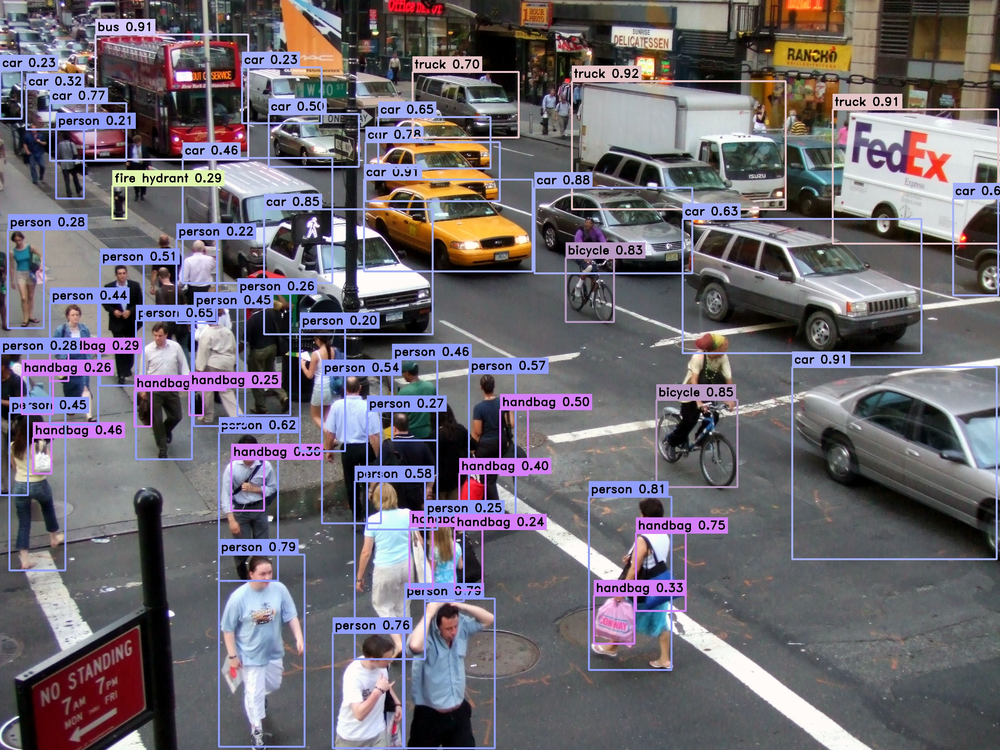

<h1 align="center"><span>TensorRT-YOLOv9</span></h1>

 This repo hosts a C++ and python implementation of the [YOLOv9](https://github.com/WongKinYiu/yolov9) state of the art object detection model, leveraging the TensorRT API for efficient real-time inference.
<p align="center" margin: 0 auto;>
  
   
</p>

## 🚀 Usage

#### C++

``` shell
cd build/release

# infer an image
yolov9-tensorrt.exe yolov9-c.engine test.jpg
# infer a folder(images)
yolov9-tensorrt.exe yolov9-c.engine data
# infer a video
yolov9-tensorrt.exe yolov9-c.engine test.mp4 # the video path
```

#### Python

``` shell
cd python
python yolov9_trt.py --engine yolov9-c.engine --data images --outdir output
```

## 🛠️ Build

#### Python

The following command will install trt python:

``` shell
cd python
pip install -r requirement.txt
```

#### C++

Refer to our [docs/INSTALL.md](https://github.com/spacewalk01/tensorrt-yolov9/blob/main/docs/INSTALL.md) for detailed installation instructions.

- Cuda preprocessing: [main branch](https://github.com/spacewalk01/TensorRT-YOLOv9/tree/main)
- Cpu preprocessing: [cpu-preprocessing branch](https://github.com/spacewalk01/TensorRT-YOLOv9/tree/cpu_preprocessing)
  
## 🖥️ Requirement
   - TensorRT
   - CUDA, CudaNN
   - C++ compiler with C++17 or higher support
   - CMake 3.14 or higher
   - OpenCV

## 🌱 Examples

Parameters for inference:

``` 
Confidence threshold : 0.2
NMS threshold : 0.3
Model : yolov9-e (with FP32)
```

Inference result:

<p align="center" margin: 0 auto;>
   
</p>
Original image: https://www.flickr.com/photos/nicolelee/19041780

## 👏 Acknowledgement

This project is based on the following awesome projects:
- [YOLOv9](https://github.com/WongKinYiu/yolov9) - YOLOv9: Learning What You Want to Learn Using Programmable Gradient Information.
- [TensorRT](https://github.com/NVIDIA/TensorRT/tree/release/8.6/samples) - TensorRT samples and api documentation.
- [TensorRTx](https://github.com/wang-xinyu/tensorrtx) - Implementation of popular deep learning networks with TensorRT network definition API.

## 🔗 See also
- [Yolov9-Bytetrack](https://github.com/spacewalk01/yolov9-bytetrack-tensorrt) - Integration of YOLOv9 with ByteTracker using the TensorRT API.
