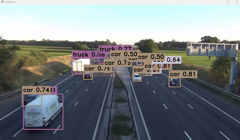
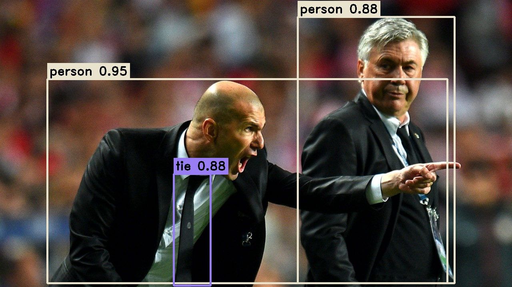

<h1 align="center"><span>YOLOv9 TensorRT C++</span></h1>

 This repo hosts a C++ implementation of the [YOLOv9](https://github.com/WongKinYiu/yolov9) state of the art object detection model, leveraging the TensorRT API for efficient real-time inference.
<p align="center" margin: 0 auto;>
  
   
</p>

## 🚀 Usage

``` shell
# infer an image
yolov9-tensorrt.exe yolov9-c.engine test.jpg
# infer a folder(images)
yolov9-tensorrt.exe yolov9-c.engine data
# infer a video
yolov9-tensorrt.exe yolov9-c.engine test.mp4 # the video path
```

## 🛠️ Setup

We refer to our [docs/INSTALL.md](https://github.com/spacewalk01/tensorrt-yolov9/blob/main/docs/INSTALL.md) for detailed installation instructions.

## 👏 Acknowledgement

This project is based on the following awesome projects:
- [Yolov9](https://github.com/WongKinYiu/yolov9) - YOLOv9: Learning What You Want to Learn Using Programmable Gradient Information.
- [TensorRT](https://github.com/NVIDIA/TensorRT/tree/release/8.6/samples) - TensorRT samples and api documentation.
